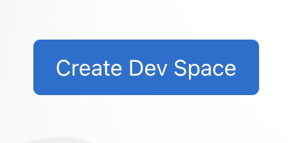
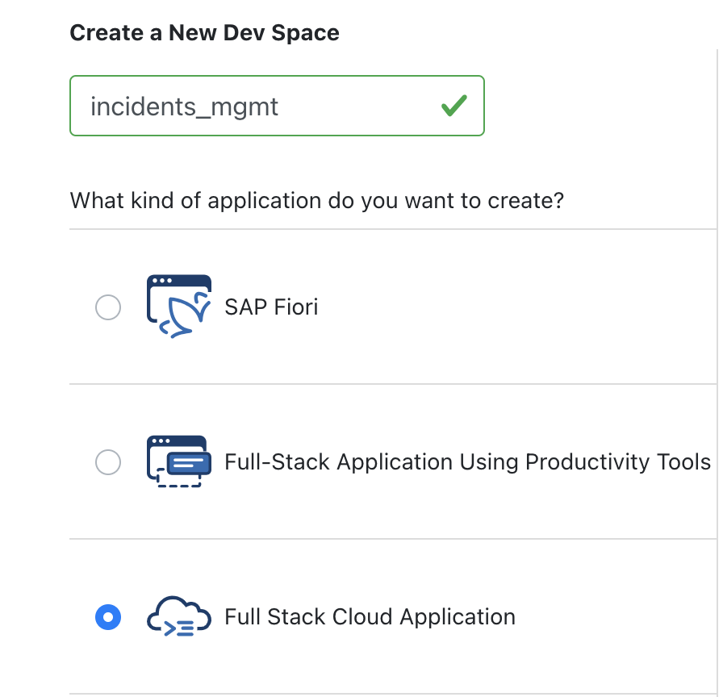
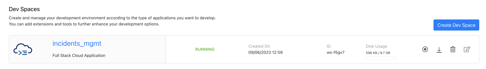
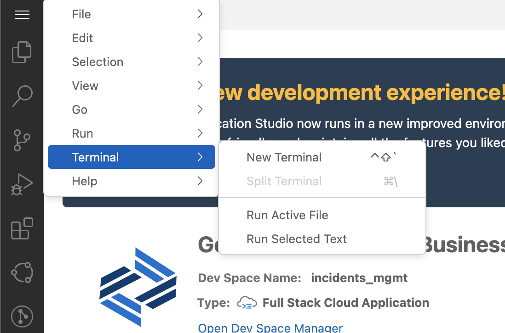

# Setting up Dev Environment

1. Open the [Business Application Studio](https://bas-dlm-eu12.eu12cf.int.applicationstudio.cloud.sap/index.html)
2. Click on `Create Dev Space`
 

 

3. You will be redirected to choose what kind of application you want to create and to choose the name of the dev space.
 

Here, you can name the dev space as `incidents_mgmt` and choose `Full Stack Cloud Application`
 

 

4. Click on `Create Dev Space`
 

 

5. Wait for the dev space to start, once it has started running, you can open it.
 

 

6. Your space is ready for use. You can open the terminal by clicking on the top left button and then `Terminal -> New Terminal`
 

***

Proceed with the next step: [Introduction to the Incident Management application](02_node_introduction_to_incident_management_application.md)