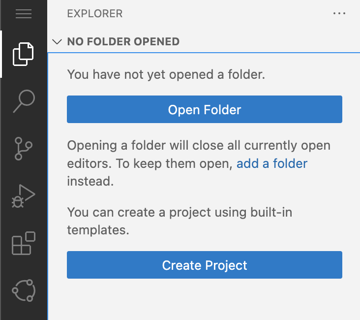

# Incident Management Application

In this exercise we assume we are a developer given the task to implement an application to create and manage incidents, that is customer support messages.
The application will allow customers to create incidents, processed by support team members. Both add comments to a conversation. Eventually, a repair appointment is created with a service worker assigned.

## Create a new project

To create a new CAP project, you can use the `cds init` command. This command creates the needed project configuration for you to start developing your application. Since this exercise is about creating a simple incident management application, the project name will be `incidents`.

Use the following command in the terminal:
```sh
cds init incidents --add java
```

## Load the project in the editor

Now, it's time to load our IDE and access the newly created directory.
You can open the project folder `incidents` in your choice of IDE

In BAS:

1. Go to `Explorer -> Open Folder`
<br/>


<br/>

2. Choose `incidents` from the file explorer.
<br/>


<br/>

Basic CAP structure containing folder `app`, `db` and `srv` has been created. 

Open the terminal and start the CAP server by using `mvn cds:watch` in the Integrated Terminal.

```sh
cd srv
mvn cds:watch
```

The CAP server serves all the CAP sources from your project. It also "watches" all the files in your projects and conveniently restarts whenever you save a file. Changes you have made will immediately be served without you having to do anything.
<br/>

Currently, it will show 
```
[ERROR] CdsMojo: [ERROR] No .cds models found, please specify one as an argument 
```

It tells you that there is no model and no service definitions yet that it can compile and serve.
<br/>

We will be adding the service definitions in the upcoming modules.

***

Proceed with the next step: [Domain modeling](03_java_domain_modeling.md)