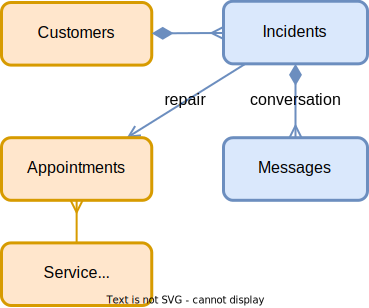

# Domain Modeling

The conceptual domain model for our incidents management application is as follows:

- Customers can create Incidents (either directly or via agents)
- Incidents have a title and a Conversation of several Messages
- Incidents are resolved through repairs, kept track of as scheduled Appointments of available Service Workers

<br/> <br/>



<br/>

## Steps:
1. Create a file `schema.cds` in `db` folder of the project.
2. Copy the following content in the file:

```cds
using { cuid, managed, sap.common.CodeList } from '@sap/cds/common';
namespace sap.capire.incidents;

/**
 * Customers using products sold by our company.
 * Customers can create support Incidents.
 */
entity Customers : cuid, managed {
  firstName     : String;
  lastName      : String;
  email         : EMailAddress;
  phone         : PhoneNumber;
  city          : City;
  postCode      : String;
  streetAddress : String;
  incidents     : Composition of many Incidents on incidents.customer = $self;
}

/**
 * Incidents created by Customers.
 */
entity Incidents : cuid, managed {  
   customer     : Association to Customers;
   title        : String  @title : 'Title';
   urgency      : Association to Urgency;
   status       : Association to Status; 
   conversations: Composition of many Conversations on conversations.incidents = $self;
}

entity Status : CodeList {
    key code: String enum {
        new = 'N';
        assigned = 'A'; 
        in_process = 'I'; 
        on_hold = 'H'; 
        resolved = 'R'; 
        closed = 'C'; 
};
}

entity Urgency : CodeList {
    key code: String enum {
        high = 'H';
        medium = 'M'; 
        low = 'L'; 
};
}

 entity Conversations : cuid, managed {
         incidents : Association to Incidents;
         timestamp : DateTime;
         author    : String @cds.on.insert: $user;
         message   : String;
   }

type EMailAddress : String;
type PhoneNumber : String;
type City : String;

```

<br/>

Note: You can read more about [Domain Modelling](https://cap.cloud.sap/docs/guides/domain-modeling), [entites](https://cap.cloud.sap/docs/cds/cdl#entities) and [types](https://cap.cloud.sap/docs/cds/cdl#types).
<br/>

As soon as the CDS file is saved, you can start your CAP Java application. Open a terminal (like described above) and run the commands

```
cd srv
mvn cds:watch
```

The `mvn cds:watch` command keeps an eye on your changes (including the CDS files) and triggers a rebuild and restart automatically. 

On the started application you won't be able to see much, yet. There are no definitions for the service interface of your application. You'll create them in the next step. :)

***

Proceed with the next step: [Creating services](04_java_creating_services.md)
