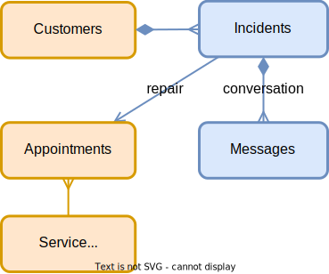

# Domain Modeling

The conceptual domain model for our incidents management application is as follows:

- Customers can create Incidents (either directly or via agents)
- Incidents have a title and a Conversation of several Messages
- Incidents are resolved through repairs, kept track of as scheduled Appointments of available Service Workers

<br/> <br/>



<br/>

## Steps:
1. Create a file `schema.cds` in `db` folder of the project.
2. Copy the following content in the file:

```cds
using { cuid, managed, sap.common.CodeList } from '@sap/cds/common';
namespace sap.capire.incidents;

/**
 * Customers using products sold by our company.
 * Customers can create support Incidents.
 */
entity Customers : cuid, managed {
  firstName     : String;
  lastName      : String;
  email         : EMailAddress;
  phone         : PhoneNumber;
  city          : City;
  postCode      : String;
  streetAddress : String;
  incidents     : Composition of many Incidents on incidents.customer = $self;
}

/**
 * Incidents created by Customers.
 */
entity Incidents : cuid, managed {  
   customer     : Association to Customers;
   title        : String  @title : 'Title';
   urgency      : Association to Urgency;
   status       : Association to Status; 
   conversations: Composition of many Conversations on conversations.incidents = $self;
}

entity Status : CodeList {
    key code: String enum {
        new = 'N';
        assigned = 'A'; 
        in_process = 'I'; 
        on_hold = 'H'; 
        resolved = 'R'; 
        closed = 'C'; 
};
}

entity Urgency : CodeList {
    key code: String enum {
        high = 'H';
        medium = 'M'; 
        low = 'L'; 
};
}

 entity Conversations : cuid, managed {
         incidents : Association to Incidents;
         timestamp : DateTime;
         author    : String @cds.on.insert: $user;
         message   : String;
   }

type EMailAddress : String;
type PhoneNumber : String;
type City : String;

```

<br/>

Note: You can read more about [Domain Modelling](https://cap.cloud.sap/docs/guides/domain-modeling), [entites](https://cap.cloud.sap/docs/cds/cdl#entities) and [types](https://cap.cloud.sap/docs/cds/cdl#types).
<br/>

As soon as the CDS file is saved, the running `cds watch` commands reacts immediately with the CDS application and reload of the application takes place. The embedded database of the started application will reflect the schema defined in your CDS file.

***

Proceed with the next step: [Creating services](04_node_creating_services.md)