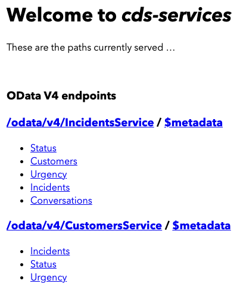

# Creating Services

After defining the model, the running application is still not exposing any service endpoints.

It's a good practice in CAP to create one service per use case. Hence, we will add two service definitions to it for the different use cases:

- A `CustomersService` for customers to create and browse their own incidents.
- An `IncidentsService` for support engineers to process incidents created by customers.

## Steps:

1. Create a new file `customers-service.cds` in the `srv` folder of your project.

2. Copy the following content in the file:

```cds
using { sap.capire.incidents as my } from '../db/schema';

/**
 * Used by Customers to create and browse their Incidents.
 */
service CustomersService {
  entity Incidents as projection on my.Incidents { *
  } excluding { modifiedBy } where customer.ID = $user;
}
```

3. Create a new file `incidents-service.cds` in the `srv` folder of your project.

4. Copy the following content in the file:

```cds
using { sap.capire.incidents as my } from '../db/schema';

service IncidentsService { 
  @odata.draft.enabled
  entity Incidents as projection on my.Incidents;
  entity Customers as projection on my.Customers;
  entity Conversations as projection on my.Conversations;
  entity Urgency as projection on my.Urgency;
  entity Status as projection on my.Status;
}
```

The application is reloaded, open the url mentioned in the terminal in your browser and you can see the generic index.html page:
<br/>


<br/>

## Adding Custom Logic

You can add custom code to deal with the specific domain logic of your application.

- Create a new folder `handlers` in the `srv/src/main/java/customer/incidents` folder.
- Create a new file `IncidentUrgencyHandler.java` in that folder and add the following content:

```java
package customer.incidents.handlers;


import java.util.List;
import java.util.Locale;

import org.slf4j.Logger;
import org.slf4j.LoggerFactory;
import org.springframework.stereotype.Component;

import com.sap.cds.services.cds.CqnService;
import com.sap.cds.services.handler.EventHandler;
import com.sap.cds.services.handler.annotations.After;
import com.sap.cds.services.handler.annotations.ServiceName;

import cds.gen.incidentsservice.Incidents;
import cds.gen.incidentsservice.IncidentsService_;

@Component
@ServiceName(IncidentsService_.CDS_NAME)  
public class IncidentUrgencyHandler implements EventHandler {
	private static final Logger logger = LoggerFactory.getLogger(IncidentUrgencyHandler.class);
	
	@After(event = CqnService.EVENT_READ)  
	public void ensureHighUrgencyForIncidentsWithUrgentInTitle(List<Incidents> incidents) {  
		for (Incidents incident : incidents) { 
			if (incident.getTitle().toLowerCase(Locale.ENGLISH).contains("urgent") &&  
				incident.getUrgencyCode() == null || !incident.getUrgencyCode().equals("H")) {  
					incident.setUrgencyCode("H");  
				logger.info("Adjusted Urgency for incident '{}' to 'HIGH'.", incident.getTitle());  
			}  
		}  
	}  
	
}
```

You can read more about [Providing Services](https://cap.cloud.sap/docs/guides/providing-services/) 

***

Proceed with the next step: [Adding data](05_java_adding_data.md)