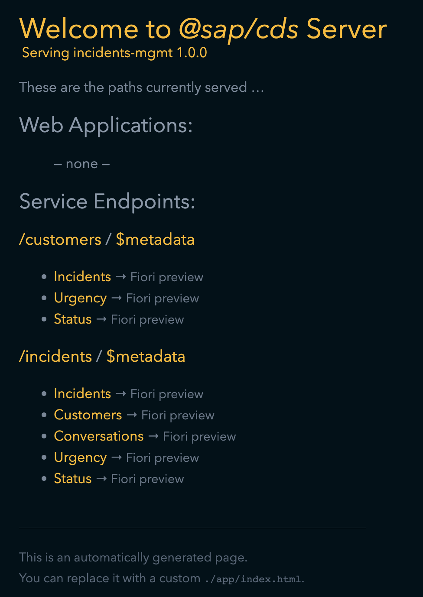

# Creating Services

After defining the model, the running application is still not exposing any service endpoints.

It's a good practice in CAP to create one service per use case. Hence, we will add two service definitions to it for the different use cases:

- A `CustomersService` for customers to create and browse their own incidents.
- An `IncidentsService` for support engineers to process incidents created by customers.

## Steps:

1. Create a new file `customers-service.cds` in the `srv` folder of your project.

2. Copy the following content in the file:

```cds
using { sap.capire.incidents as my } from '../db/schema';

/**
 * Used by Customers to create and browse their Incidents.
 */
service CustomersService {
  entity Incidents as projection on my.Incidents { *
  } excluding { modifiedBy } where customer.ID = $user;
}
```

3. Create a new file `incidents-service.cds` in the `srv` folder of your project.

4. Copy the following content in the file:

```cds
using { sap.capire.incidents as my } from '../db/schema';

service IncidentsService { 
  @odata.draft.enabled
  entity Incidents as projection on my.Incidents;
  entity Customers as projection on my.Customers;
  entity Conversations as projection on my.Conversations;
  entity Urgency as projection on my.Urgency;
  entity Status as projection on my.Status;
}
```

The application is reloaded, open the url mentioned in the terminal in your browser and you can see the generic index.html page:
<br/>


<br/>

## Adding Custom Logic

You can add custom code to deal with the specific domain logic of your application.

- Create file `incidents-service.js` in `srv` folder and add the following content:

```js
const cds = require('@sap/cds')

class IncidentsService extends cds.ApplicationService {
  /** Registering custom event handlers */
  init() {
    this.before("UPDATE", "Incidents", (req) => this.onUpdate(req));
    this.after("READ", "Incidents", (data) => this.changeUrgencyDueToSubject(data));

    return super.init();
  }

  changeUrgencyDueToSubject(data) {
    if (data) {
      const incidents = Array.isArray(data) ? data : [data];
      incidents.forEach((incident) => {
        if (incident.title?.toLowerCase().includes("urgent")) {
          incident.urgency = { code: "H", descr: "high" };
        }
      });
    }
  }

  /** Custom Validation */
  async onUpdate (req) {
    const { status_code } = await SELECT.one(req.subject, i => i.status_code).where({ID: req.data.ID})
    if (status_code === 'C')
      return req.reject(`Can't modify a closed incident`)
  }
}
module.exports = IncidentsService
```

You can read more about [Providing Services](https://cap.cloud.sap/docs/guides/providing-services/) 

***

Proceed with the next step: [Adding data](05_node_adding_data.md)