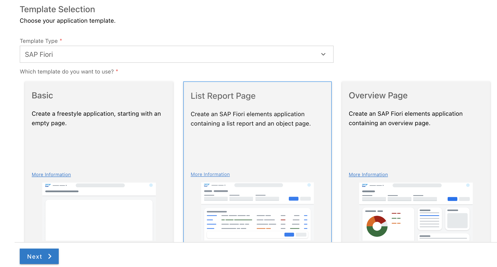
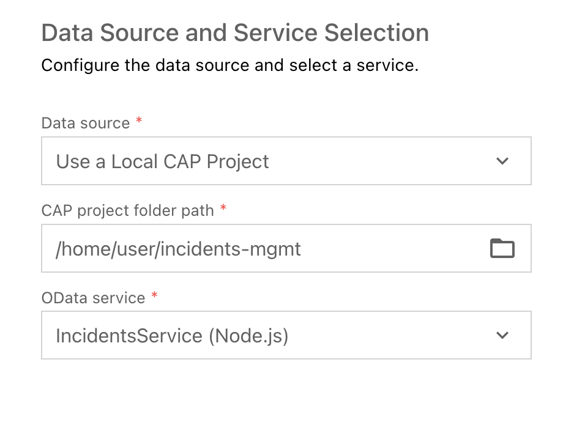

# Adding Fiori elements UIs

SAP Fiori elements provides designs for UI patterns and predefined floorplans for common application use cases. One can use SAP Fiori elements to create SAP Fiori applications based on OData services and annotations that don't need JavaScript UI coding. The resulting app uses predefined views and controllers based on SAPUI5 that are provided centrally. This means no application-specific view instances are required. SAP Fiori elements interprets metadata and annotations of the underlying OData service and uses the corresponding views for the SAP Fiori app at startup.

## Generate the UI with an SAP Fiori elements templete

1. In BAS, invoke the Command Palette (`Settings -> Command Palette`) and choose `Fiori: Open Application Generator`.

2. Choose application type `SAP Fiori` and template `List Report Page`.
 

 

3. Choose `Next`

4. In the next dialog, choose `Use a Local CAP Project` and choose your current `incidents-mgmt` project.

5. Select the `IncidentsService(Node.js`) as the OData service and choose `Next`
 

 

6. Select `Incidents` as the main entity, `conversations` as the Navigation entity. Choose the option `Yes` to add table columns automatically. Choose `Next`
 

7. Enter `incidents` as the module name and `Incident-Management` as the application title.

8. Enter `ns` as the namespace.
 

 

9. In the upcoming steps, leave the default value for all other settings.

10. Choose `Finish` to generate the application.
 

The application is now generated and in a few seconds you can see it in the `app` folder of your project. It contains a `incidents` and a `webapp` folder with a `Component.js` file that is characteristic for an SAPUI5 app.

## Modify the UI with the Fiori Page Editor

