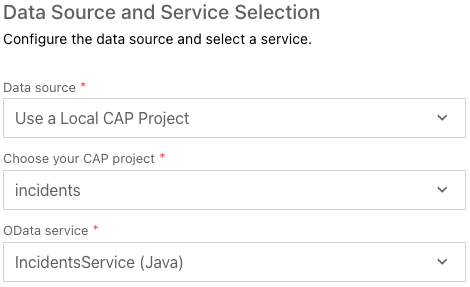
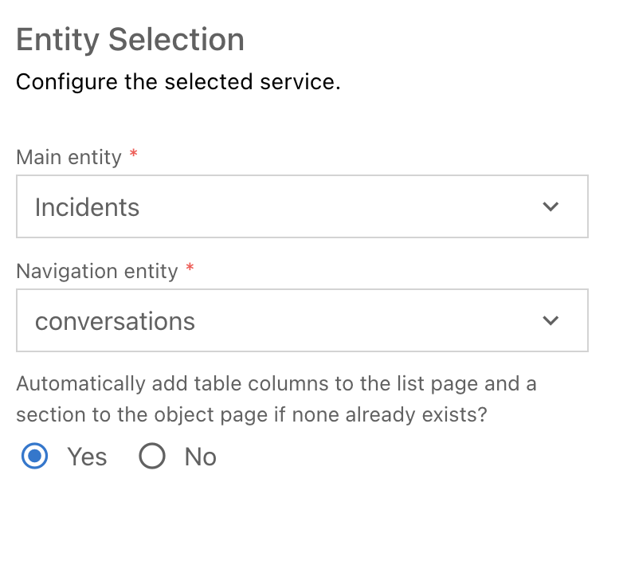
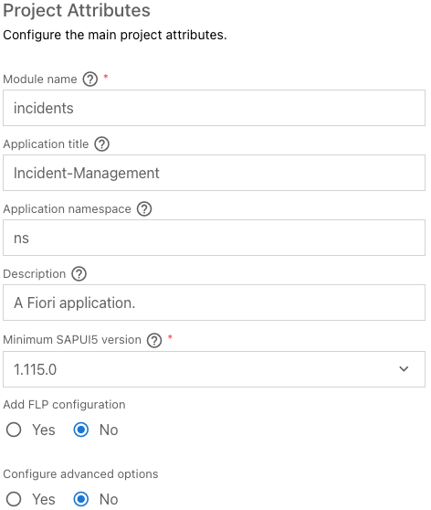

# Adding Fiori elements UIs

SAP Fiori elements provides designs for UI patterns and predefined floorplans for common application use cases. One can use SAP Fiori elements to create SAP Fiori applications based on OData services and annotations that don't need JavaScript UI coding. The resulting app uses predefined views and controllers based on SAPUI5 that are provided centrally. This means no application-specific view instances are required. SAP Fiori elements interprets metadata and annotations of the underlying OData service and uses the corresponding views for the SAP Fiori app at startup.

## Generate the UI with an SAP Fiori elements template

1. In BAS, invoke the Command Palette (`Settings -> Command Palette`) and choose `Fiori: Open Application Generator`.

2. Choose application type `SAP Fiori` and template `List Report Page`.
<br/>


<br/>

3. Choose `Next`

4. In the next dialog, choose `Use a Local CAP Project` and choose your current `incidents` project.

5. Select the `IncidentsService(Java)` as the OData service and choose `Next`
<br/>


<br/>

6. Select `Incidents` as the main entity, `conversations` as the Navigation entity. Choose `Next`
<br/>



7. Enter `incidents` as the module name and `Incident-Management` as the application title.

8. Enter `ns` as the namespace.
<br/>


<br/>

9. In the upcoming steps, leave the default value for all other settings.

10. Choose `Finish` to generate the application. The application is now generated and in a few seconds you can see it in the `app` folder of your project. It contains a `incidents` and a `webapp` folder with a `Component.js` file that is characteristic for an SAPUI5 app. The process is finished when the "Application Information" screen for the newly generated UI appears.

11. In order to have a working UI you need to add the following content to your UI annotations in `app/incidents/annotations.cds`:

```cds
annotate service.Incidents with @(
    UI.LineItem : [
        {
            $Type : 'UI.DataField',
            Value : title,
        },
        {
            $Type : 'UI.DataField',
            Label : 'urgency_code',
            Value : urgency_code,
        },
        {
            $Type : 'UI.DataField',
            Label : 'status_code',
            Value : status_code,
        },
    ]
);
annotate service.Incidents with @(
    UI.FieldGroup #GeneratedGroup1 : {
        $Type : 'UI.FieldGroupType',
        Data : [
            {
                $Type : 'UI.DataField',
                Value : title,
            },
            {
                $Type : 'UI.DataField',
                Label : 'urgency_code',
                Value : urgency_code,
            },
            {
                $Type : 'UI.DataField',
                Label : 'status_code',
                Value : status_code,
            },
        ],
    },
    UI.Facets : [
        {
            $Type : 'UI.ReferenceFacet',
            ID : 'GeneratedFacet1',
            Label : 'General Information',
            Target : '@UI.FieldGroup#GeneratedGroup1',
        },
    ]
);
```

<br/>

12. Browse the generated appliction. Restart the `mvn cds:watch` command (in the `srv` folder) in case it's still running (if not just start it) and open the index page in your browser. To do so, open the Command Palette (`Setting` -> `Command Palette` and choose `Ports: Preview`. There, select the entry with port 8080 (the CAP Java default port). Now append `/incidents/webapp/index.html` to the URL in your browser`s address bar.

13. In the application you can click the "Go" button on the right hand side and load all incidents from the database. By clicking an incident from the list you can open the details view. Use the browser's `back` button to navigate back to the list.


***

Proceed with the next step: [Adding authorization](07_java_adding_authorization.md)
