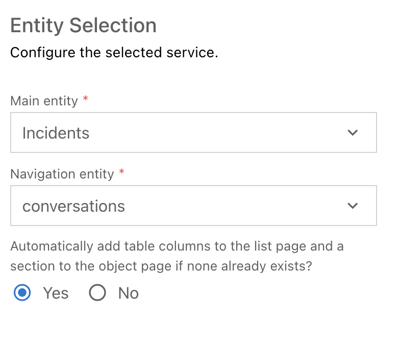
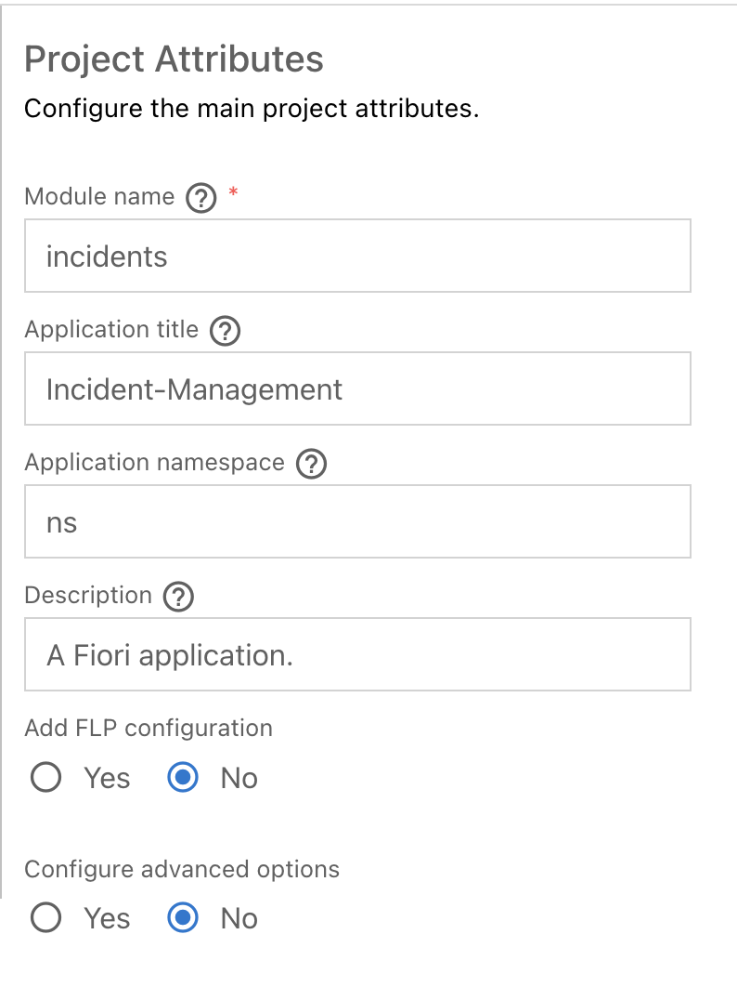

# Adding Fiori elements UIs

SAP Fiori elements provides designs for UI patterns and predefined floorplans for common application use cases. One can use SAP Fiori elements to create SAP Fiori applications based on OData services and annotations that don't need JavaScript UI coding. The resulting app uses predefined views and controllers based on SAPUI5 that are provided centrally. This means no application-specific view instances are required. SAP Fiori elements interprets metadata and annotations of the underlying OData service and uses the corresponding views for the SAP Fiori app at startup.

## Generate the UI with an SAP Fiori elements template

1. In BAS, invoke the Command Palette (`Settings -> Command Palette`) and choose `Fiori: Open Application Generator`.

2. Choose application type `SAP Fiori` and template `List Report Page`.
 

 

3. Choose `Next`

4. In the next dialog, choose `Use a Local CAP Project` and choose your current `incidents-mgmt` project.

5. Select the `IncidentsService(Node.js)` as the OData service and choose `Next`
 

 

6. Select `Incidents` as the main entity, `conversations` as the Navigation entity. Choose the option `Yes` to add table columns automatically. Choose `Next`
 

7. Enter `incidents` as the module name and `Incident-Management` as the application title.

8. Enter `ns` as the namespace.
 

 

9. In the upcoming steps, leave the default value for all other settings.

10. Choose `Finish` to generate the application.
 

The application is now generated and in a few seconds you can see it in the `app` folder of your project. It contains a `incidents` and a `webapp` folder with a `Component.js` file that is characteristic for an SAPUI5 app.

11. Browse the generated application

Once the application generation wizard is completed the `app` folder contains a new folder with the generated application. Start the `cds watch` command in case it's not running anymore and open the index page in your browser. To do so, you have 2 options:

 * From the log output of the running applicatoin you can click the http://localhost:4004 link. Don't enter it manually to the browser but only click the link from the log. It will redirect you to the right "cloud localhost". :) 
 * Alternatively, open the Command Palette (`Setting` -> `Command Palette` and choose `Ports: Preview`. There, select the entry with port 4004 (the CAP node.js default port). Now, the index page of your CAP application is displayed and has an entry for the just generated UI. Navigate the link and browse the new application.

In the application you can click the "Go" button on the right hand side and load all incidents from the database. By clicking an incident from the list you can open the details view. Use the browser's `back` button to navigate back to the list.

***

Proceed with the next step: [Adding authorization](07_node_adding_authorization.md)