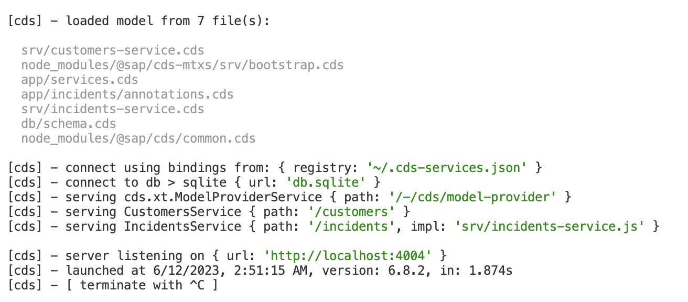

# Adding multitenancy to the application

Multitenancy is the ability to serve multiple tenants through single clusters of micro service instances, while ensuring strict isolation with respect to tenants data and access to it. Tenants are clients using SaaS solutions.

In contrast to single-tenant mode, applications aren't serving end-user request immediately after deployment, but wait for tenants to subscribe.
<br/>

CAP has built-in support for multitenancy with the `@sap/cds-mtx` package.
<br/>

## Enable Multitenancy

Execute the following command in the p[roject root"
<br/>

```sh
    cds add multitenancy
```
This command does the following two steps:

1. Add `@sap/cds-mtxs` package dependeny

```sh
npm add @sap/cds-mtxs
```

2. Switch on cds.requires.multitenancy
Adds the following configuration to the `package.json`:

```cds
"cds":{
    "requires":{
        "multitenancy": true
    }
}
```

Now, run `npm install` to update the node modules:

```sh
npm install
```

## Testing Locally

To test multitenancy, just run the CAP server, and then log on with different users, assigned to different tenants, to see the effects

Start the server:

```sh
cds watch
```

This produces an output like:
<br/>


<br/>

In contrast to single-tenant mode, we recognize differences in the log output with regards to the database initialization and the services that are bootstrapped.
